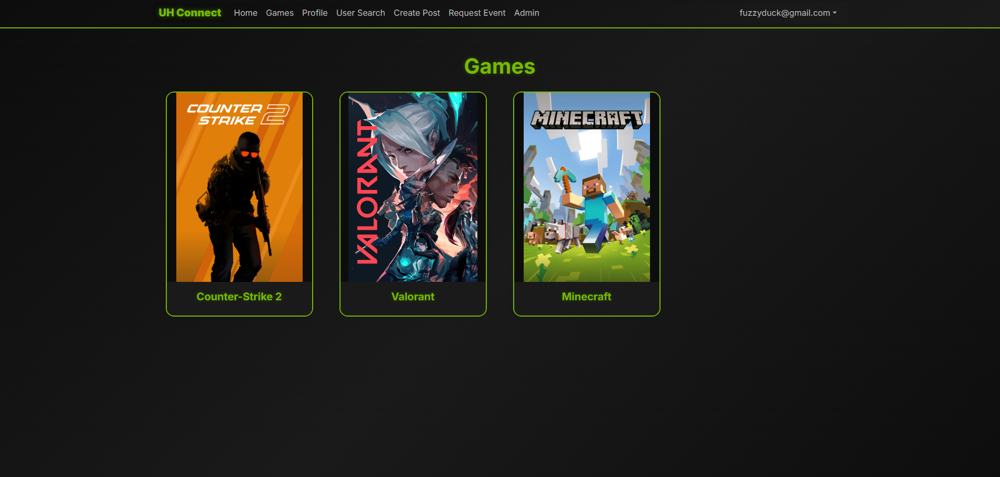
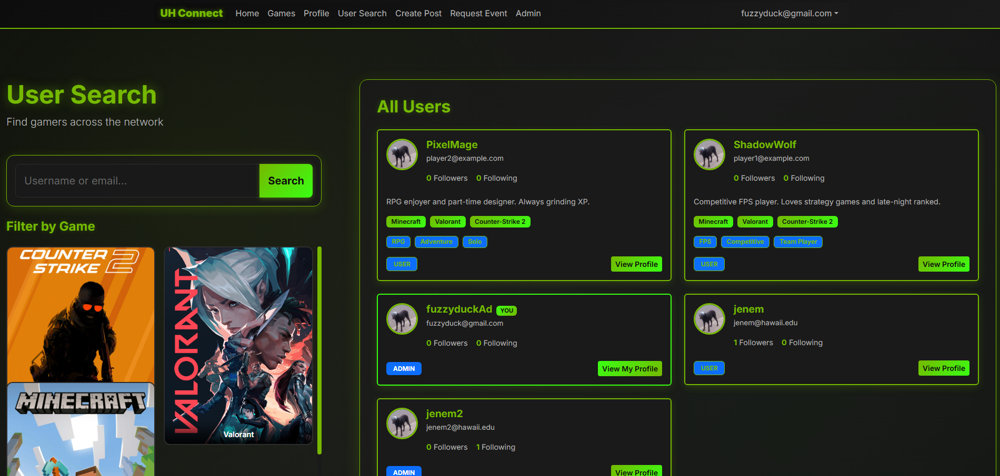
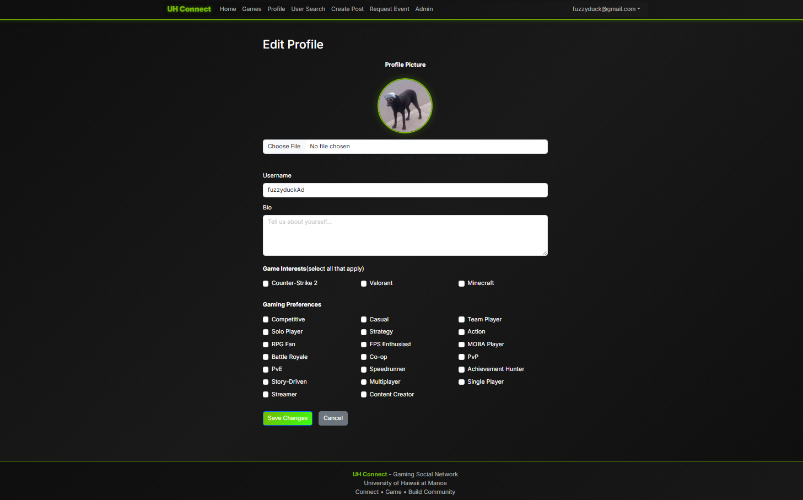
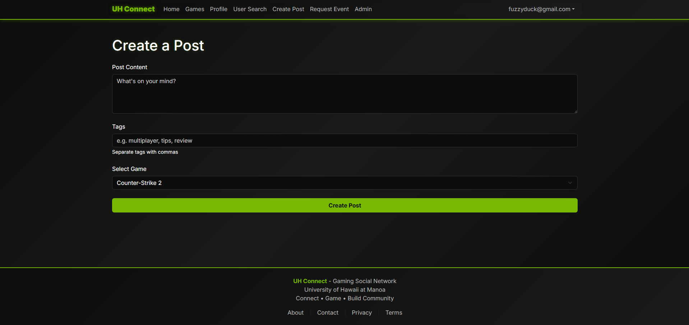
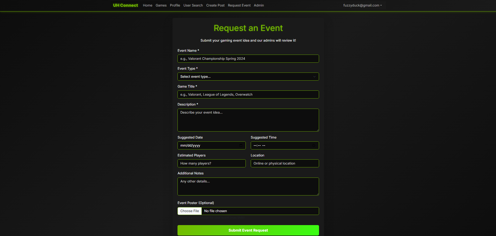
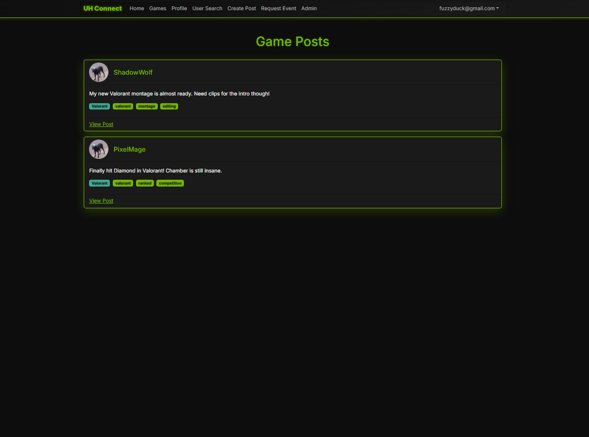

# Overview

UH Connect is a web application that helps UH students discover and connect with other gamers on campus based on their favorite games, skill levels, gaming goals (casual play, ranked competition, streaming, etc.), and availability. By creating detailed gamer profiles, students can find like-minded players to form teams, join communities, or just find new friends to play with.

## What makes UH Connect special:

- **Campus-Focused:** Exclusively for UH students, creating a trusted gaming community
- **Interest Matching:** Advanced filtering by game preferences, play styles, and skill levels
- **Event Discovery:** Centralized hub for gaming tournaments, LAN parties, and esports events on campus
- **Personalized Recommendations:** AI-driven game and player suggestions based on user profiles
- **Team Building:** Easy formation of competitive teams and casual gaming groups

Unlike general gaming platforms like Discord or Reddit, UH Connect provides a curated, campus-specific environment where students can safely connect with verified UH peers who share their gaming interests.

### Deployment

**Live Application:** [https://uh-connect.vercel.app/](https://uh-connect.vercel.app/)

[](https://github.com/gamer-connects/Project-UHConnect/actions/workflows/ci.yml)

### Links

- **Team Contract:** [View Team Contract](https://docs.google.com/document/d/1T8ZwthSHFkZXGYaHPbhu9UNYf5ETw5f2L7wtiD0ZBfA/edit?tab=t.0)
- **GitHub Organization:** [gamer-connects](https://github.com/gamer-connects)
- **M1 Project Board:** [Milestone 1](https://github.com/orgs/gamer-connects/projects/1/views/3)
- **M2 Project Board:** [Milestone 2](https://github.com/orgs/gamer-connects/projects/2/views/3)
- **M3 Project Board:** [Milestone 3](https://github.com/orgs/gamer-connects/projects/6)
- **Test Cases:** [View Test Cases](https://docs.google.com/document/d/1Q7q8-GTRSqjTLsZUTha8je2IafpYSgQ_MWMlM6Z9suw/edit?usp=sharing)
## User Guide

### Landing Page


### Sign Up/Sign In


### User Profile Page


### Home Page


### Game Page


### User Search Page



### Edit Profile Page


### Create Post Page


### Event Request Page


### Game Post Page


### Admin Page


### Use Case Diagrams


### Risk Management Worksheet


## Community Feedback
*Coming soon — will include user impressions, feature requests, and comments gathered from early testers.*

---

## Developer Guide

## Installation

**Prerequisites:**
* Node.js (v18 or higher)
* npm or yarn
* Git

**Steps:**

1. Clone the repository:
```bash
   git clone https://github.com/gamer-connects/Project-UHConnect.git
```

2. Navigate into the project directory:
```bash
   cd Project-UHConnect
```

3. Install dependencies:
```bash
   npm install
```

4. (Optional) Create an environment file if your project requires variables:
```bash
   touch .env.local
```
   
   Add values such as:
```
   NEXT_PUBLIC_API_URL=<your-api-url>
   NEXTAUTH_SECRET=<your-secret>
   UHCDB_POSTGRES_PRISMA_URL=<your-postgres-connection-string>
   UHCDB_POSTGRES_URL_NON_POOLING=<your-direct-postgres-url>
```

5. Initialize the database:
```bash
   npx prisma migrate dev
```

6. Start the development server:
```bash
   npm run dev
```

7. Open the application in your browser:
```
   http://localhost:3000
```

## Deployment

The application is automatically deployed through Vercel.

**To deploy changes:**

1. Commit and push your changes to the main branch:
```bash
   git add .
   git commit -m "ready for deployment"
   git push origin main
```

2. Visit your project on the [Vercel dashboard](https://vercel.com) to confirm the deployment.

**First-time deployment setup:**

1. Go to [https://vercel.com](https://vercel.com)
2. Click **Add New Project**
3. Select the `Project-UHConnect` repository
4. Set any required environment variables:
   * `UHCDB_POSTGRES_PRISMA_URL`
   * `UHCDB_POSTGRES_URL_NON_POOLING`
   * `NEXTAUTH_SECRET`
   * `NEXTAUTH_URL`
5. Click **Deploy**

After deployment, your live site will be available at:
```
https://project-uh-connect-wbxh.vercel.app
```

You can monitor deployment logs under the **Deployments** section in Vercel.

## Team

-	Jenebryan Mercado
-	Andrew Bushong
-	Richard Masuda
-	Nalani Klopfenstein
-	Jiaxing Feng
